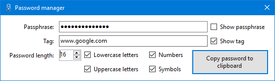

# Password Manager

*Passphrase*: The passphrase to use

*Tag*: A tag for any particular application/service/website

*Password length*: Length of the password to generate

*Lowercase letters*: Controls whether the password should contain lowercase letters

*Uppercase letters*: Controls whether the password should contain uppercase letters

*Numbers*: Controls whether the password should contain lowercase letters

*Symbols*: Controls whether the password should contain symbols

## Requirements
[.NET Framework 4.6.2](https://www.microsoft.com/en-us/download/details.aspx?id=53345)