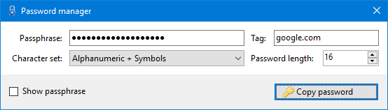

# Password Manager
## Purpose
Password manager allows you to use distinct passwords for all services you use without having the need to save them locally.
They will be derived from one master password and a public tag (which identifies the service).

## User interface

**Passphrase**: The passphrase to use.

**Tag**: A tag for any particular application/service/website.

**Character set**: The character set to choose from. The following character sets are available:

| Name                           | Characters                                      |
| ------------------------------ | ----------------------------------------------- |
| Alphabet                       | [a-zA-Z]                                        |
| Alphanumeric                   | [a-zA-Z0-9]                                     |
| Alphanumeric + Symbols         | [a-zA-Z0-9!\"#$%&\'()\*+,-./:;<=>?@[\\]^\_\`\{\|\}~]  |
| Alphanumeric + Symbols + Space | [a-zA-Z0-9 !\"#$%&\'()\*+,-./:;<=>?@[\\]^\_\`\{\|\}~] |

**Password length**: Length of the password to generate.

**Copy password**: Generates the password and copies it to clipboard.

## Cryptography
In order to derive the password the program uses the following algorithm:

**tls-prf**(*secret:* **hmacsha256**(*key:* "secret", passphrase), *seed:* **hmacsha256**(*key:* "tag", tag));

## Requirements
[.NET Framework 4.6.2](https://www.microsoft.com/en-us/download/details.aspx?id=53345)
