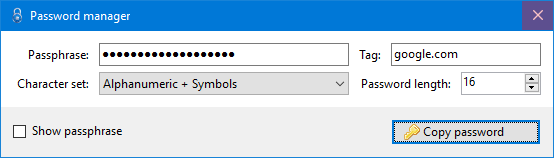

# Password Manager

**Passphrase**: The passphrase to use.

**Tag**: A tag for any particular application/service/website.

**Character set**: The character set to choose from. The following character sets are available:

| Name                           | Characters                                      |
| ------------------------------ | ----------------------------------------------- |
| Alphabet                       | [a-zA-Z]                                        |
| Alphanumeric                   | [a-zA-Z0-9]                                     |
| Alphanumeric + Symbols         | [a-zA-Z0-9!\"#$%&\'()*+,-./:;<=>?@[\\]^_`{|}~]  |
| Alphanumeric + Symbols + Space | [a-zA-Z0-9 !\"#$%&\'()*+,-./:;<=>?@[\\]^_`{|}~] |

**Password length**: Length of the password to generate.

**Lowercase letters**: Controls whether the password should contain lowercase letters.

**Uppercase letters**: Controls whether the password should contain uppercase letters.

**Numbers**: Controls whether the password should contain lowercase letters.

**Symbols**: Controls whether the password should contain symbols.

## Requirements
[.NET Framework 4.6.2](https://www.microsoft.com/en-us/download/details.aspx?id=53345)